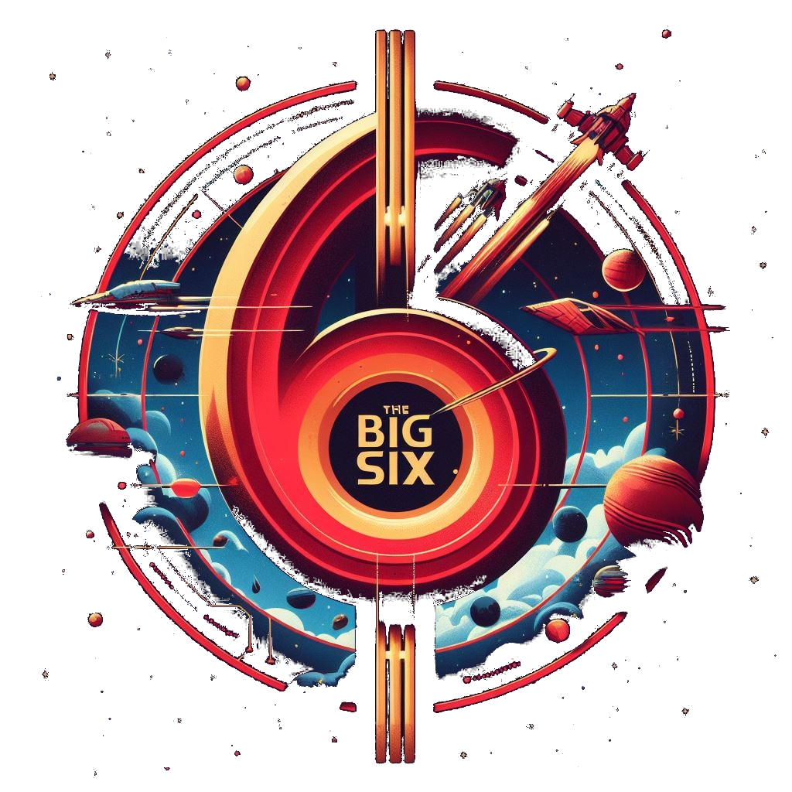
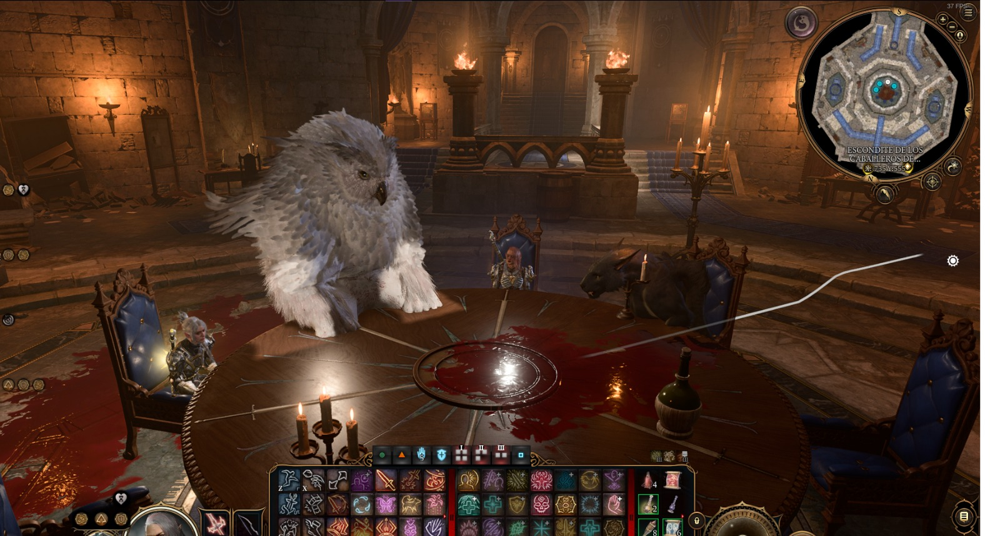

# Chamorro Ignacio
Buenas, mi nombre es Ignacio, tengo 29 años, vivo en la ciudad de Rosario y me gusta pensar en hacer jueguitos.
Tengo un par de ideas en el bloc de notas, varios proyectos empezados que nunca terminare pero le pongo onda (inserte emoji de manito arriba)
Entre a la carrera con la esperanza de poder llevar escritos que tenia a la vida a traves de los videojuegos pero el game design y la programacion me corrieron el foco.
Los proyectos realizados en las distintas materias son muestra de las ganas y el tiempo que le dedico a los juegos cuando de verdad me atraviezan, y mas si los compañeros acompañan :D
Al transcurrir el 2023 y compartir con compañeros proyectos, logramos armar un lindo grupo al cual llamamos The Big Six (el cual ya cuenta con dos prototipos en el portfolio de sus integrantes).
En lo personal esto me trajo mucha motivacion y empece a armar las ideas que mencione anteriormente.

## Datos de vital importancia para la trama
* Suelo dedicar varias horas al dia a la pc (ya sea para jugar, youtube o intentar entrar unity)
* Sigo esperando que salga BlueProtocol
* Desinstanlen el lol(hace mal)
* Sean felices

pd: en la siguiente imagen podemos ver a varios participantes del grupo jugando Space War y Content Warning

